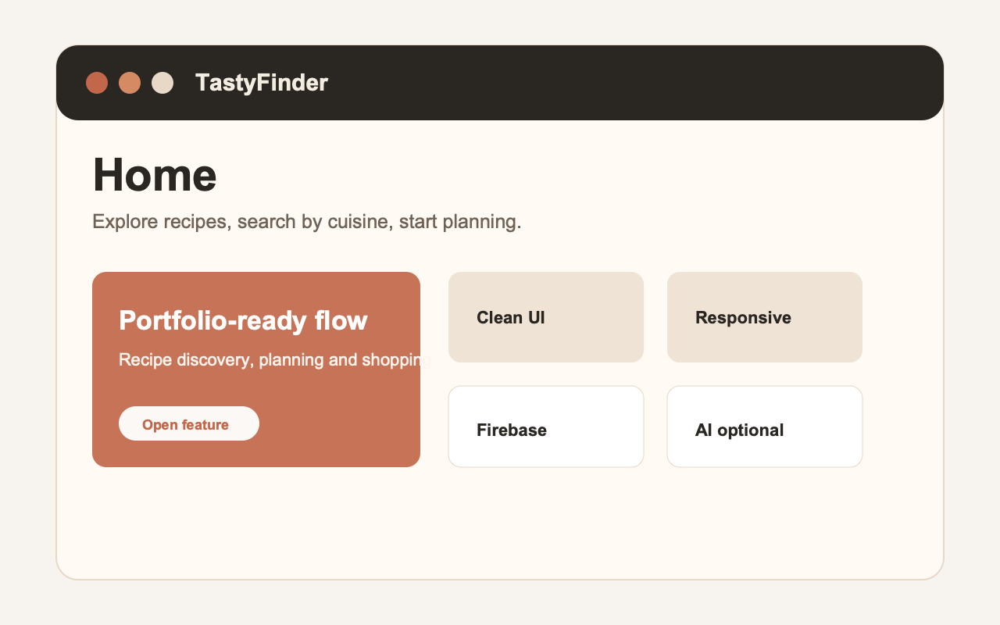
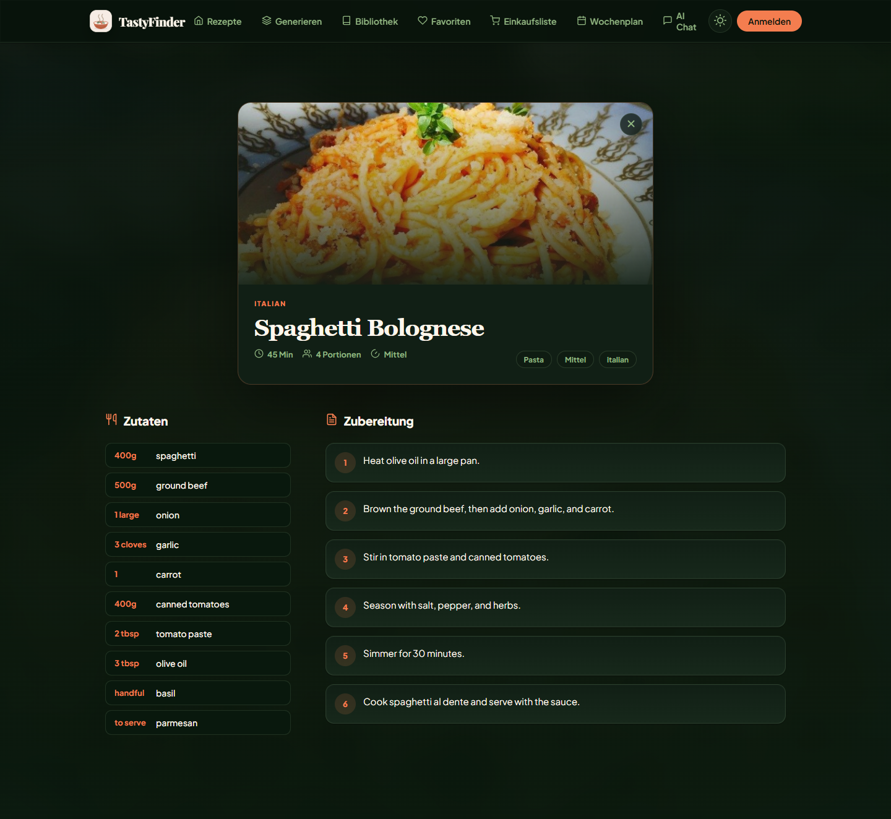
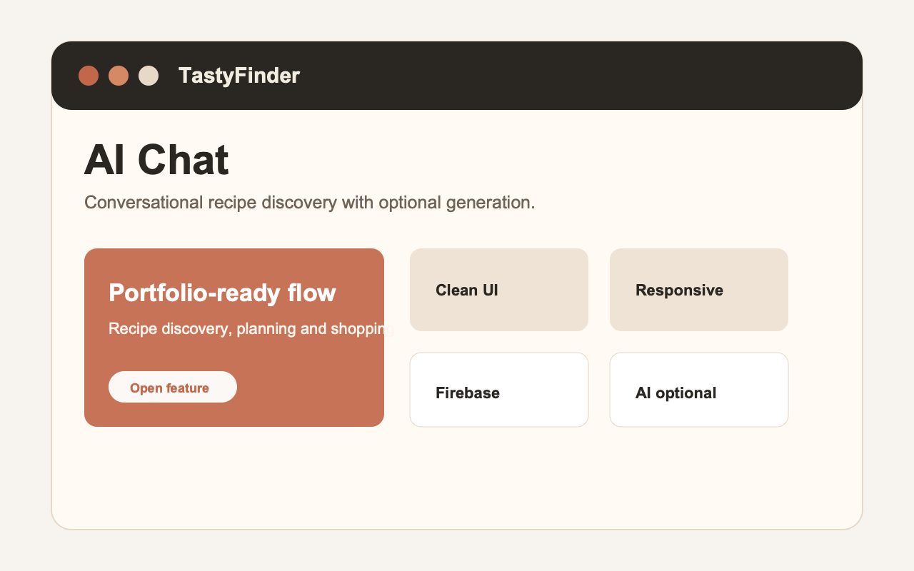
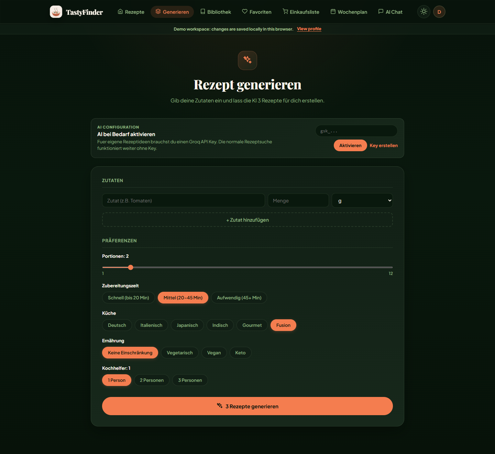
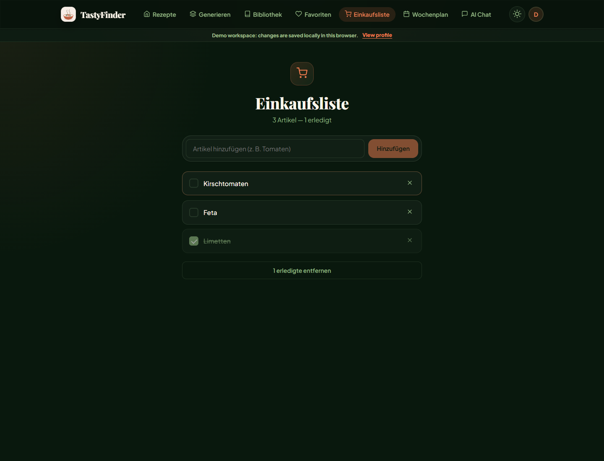
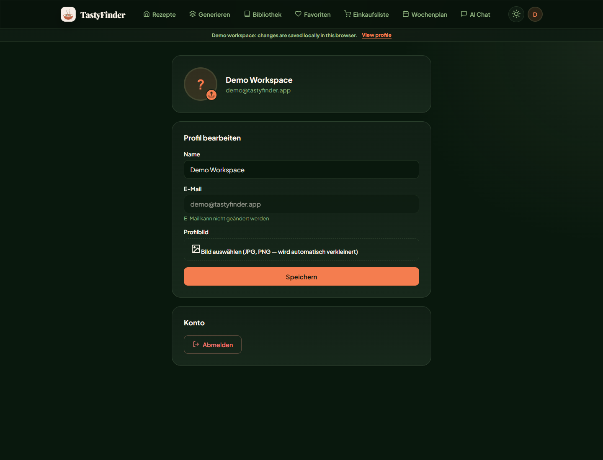

# 🍽 TastyFinder

**An AI-powered recipe discovery platform** — browse recipes, generate custom ones with AI, chat with a cooking assistant, and manage your personal cookbook, favorites and shopping list.

### 🔗 [Live Demo → tastyfinder.web.app](https://tastyfinder.web.app)

---

## 📸 Screenshots

> Add your screenshots to a `screenshots/` folder in the repo, then they appear here.

| Home | Recipe Detail | AI Chat |
|---|---|---|
|  |  |  |

| AI Generator | Shopping List | Profile |
|---|---|---|
|  |  |  |

---

## ✨ Features

- **Recipe Search** — Search by name, ingredient or cuisine
- **AI Recipe Generator** — Enter your ingredients and get tailored recipes powered by **Groq AI** (Llama 3.3 70B)
- **AI Chat Assistant** — Ask conversationally; finds matching recipes and generates new ones on the fly
- **Authentication** — Email/Password and Google Sign-In via Firebase Auth
- **Personal Library** — Generated recipes saved per user in Firestore
- **Favorites** — Save and revisit recipes (per user)
- **Shopping List** — Add ingredients from any recipe, check off items, clear completed
- **Profile** — Edit name, upload an avatar, change password
- **Responsive Design** — Clean mobile and desktop layouts
- **SSR** — Server-Side Rendering with Angular for fast initial load

---

## 🛠 Tech Stack

| Layer | Technology |
|---|---|
| Frontend | Angular 22 (Standalone, Signals), TypeScript, SCSS |
| AI | **Groq** — Llama 3.3 70B Versatile |
| Auth | Firebase Authentication |
| Database | Cloud Firestore (per-user collections) |
| Automation | **n8n** (local workflow, optional) |
| Hosting | Firebase Hosting + Angular SSR |
| State | Angular Signals + RxJS |

---

## 🤖 Groq AI

TastyFinder uses **Groq AI** (Llama 3.3 70B) for two things:

1. **Recipe generation** — turns a list of ingredients + preferences into complete recipes (steps, durations, portions)
2. **Chat assistant** — generates a fresh recipe when nothing matches the local collection

For the demo, users enter their own Groq API key (stored only in the browser's `localStorage`). In production this should run through a secure backend or an n8n webhook so the key never reaches the client.

```
Dev:        Angular → Angular Proxy → n8n Webhook → Groq
Production:  Angular → Groq API (user-supplied key)
```

---

## 🔥 Firebase

Firebase powers auth, data and hosting:

- **Authentication** — Email/Password + Google provider
- **Firestore** — each user owns their data under `users/{uid}/…`:
  ```
  users/{uid}/recipes     # AI-generated recipes (library)
  users/{uid}/favorites   # favorited recipe ids
  users/{uid}/shopping    # shopping list items
  users/{uid}/profile     # display name + avatar
  ```
- **Security Rules** ([firestore.rules](firestore.rules)) — users can only read/write their own subtree
- **Hosting** — SSR build deployed to Firebase Hosting

---

## 🔗 n8n Workflow

In local development, AI calls can be routed through an **n8n** workflow instead of calling Groq directly from the browser — demonstrating real-world workflow automation and keeping the API key server-side.

```
Webhook → Code (build prompt) → HTTP Request (Groq API) → Response
```

The Angular dev proxy ([proxy.conf.json](proxy.conf.json)) forwards `/n8n/*` to the local n8n instance. See [n8n/README.md](n8n/README.md) for setup. In production the app falls back to calling Groq directly.

---

## 🚀 Getting Started

### Prerequisites

- Node.js 22+
- npm 11+
- A free [Groq API Key](https://console.groq.com/keys) (for AI generation/chat)

### Installation

```bash
git clone https://github.com/TakouaJelassi/tastyfinder.git
cd tastyfinder
npm install --legacy-peer-deps
```

> `--legacy-peer-deps` is required because `@angular/fire@20` pins `firebase@^11`.

### Environment Setup

Create `src/environments/environment.ts` (and `environment.prod.ts`) — both are gitignored:

```ts
export const environment = {
  production: false,
  firebase: {
    apiKey: 'YOUR_FIREBASE_API_KEY',
    authDomain: 'YOUR_PROJECT_ID.firebaseapp.com',
    projectId: 'YOUR_PROJECT_ID',
    storageBucket: 'YOUR_PROJECT_ID.firebasestorage.app',
    messagingSenderId: 'YOUR_SENDER_ID',
    appId: 'YOUR_APP_ID',
  },
};
```

### Run

```bash
npm start          # http://localhost:4200
```

Enter your **Groq API Key** (`gsk_...`) in the banner to enable AI features.

### Optional: n8n (local AI automation)

```bash
N8N_SECURE_COOKIE=false npx n8n   # http://localhost:5678
```

---

## 📁 Project Structure

```
src/app/
├── core/
│   ├── data/            # Local recipe dataset
│   ├── guards/          # Auth route guard
│   ├── models/          # TypeScript interfaces
│   └── services/        # Auth, Recipe, Firestore, AI (Groq), n8n
├── features/
│   ├── home/            # Search + category filter
│   ├── generate/        # AI recipe generator
│   ├── chatbot/         # AI chat assistant
│   ├── library/         # Saved recipes
│   ├── favorites/       # Favorited recipes
│   ├── shopping/        # Shopping list
│   ├── profile/         # User profile
│   ├── auth/            # Login / Register
│   └── recipe-detail/   # Recipe detail view
└── shared/
    └── components/      # Navbar, RecipeCard, Skeleton, ApiKeyBanner
```

---

## 💡 What I Learned

- Building a full Angular 22 app with **Standalone Components** and **Signals** (no NgRx)
- **Firebase Auth** (email + Google) with an SSR-safe route guard
- Modeling **per-user data** in Firestore with security rules
- Integrating an **LLM (Groq)** for generation and conversational search
- **n8n** workflow automation bridged to Angular via a dev proxy
- Deploying **Angular SSR** to Firebase Hosting and managing multiple hosting sites
- Designing a resilient app that works even without external API quotas

---

## 🔭 Future Improvements

- Weekly meal planner with n8n automation
- Dietary filters (vegetarian, vegan, gluten-free)
- Secure backend proxy so the Groq key never touches the browser
- Recipe ratings and notes

---

## 📄 License

MIT
