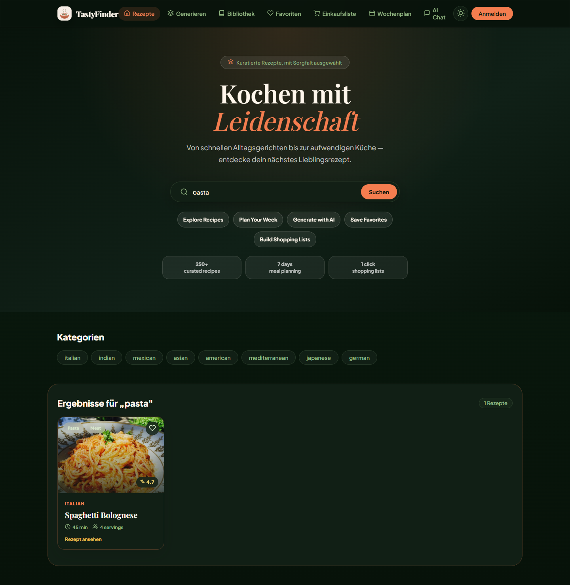
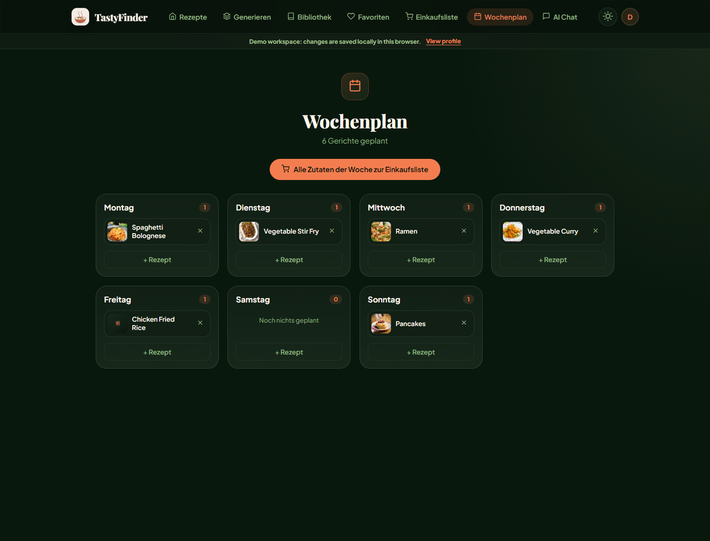
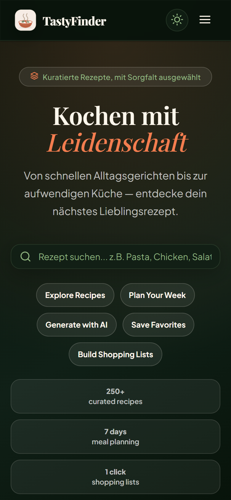

<p align="center">
  
</p>

# TastyFinder

An **AI-powered recipe discovery platform**: browse recipes, generate custom
ones with AI, chat with a cooking assistant, and manage your personal cookbook,
favorites and shopping list.

### Live Demo → [tastyfinder.web.app](https://tastyfinder.web.app)

---

## Product Screenshots

The screenshots below show the current polished product experience across
recipe discovery, AI generation, saved recipes, planning, shopping and
responsive mobile layouts. The UI supports light and dark themes; these
screenshots use the premium dark theme.

|             Home              |              Search               |           Recipe Detail           |
| :---------------------------: | :-------------------------------: | :-------------------------------: |
|  |  |  |

|            Meal Planner             |             Shopping List             |             AI Generator              |
| :---------------------------------: | :-----------------------------------: | :-----------------------------------: |
|  |  |  |

|            AI Chat            |              Mobile               |               Profile               |
| :---------------------------: | :-------------------------------: | :---------------------------------: |
|  |  |  |

---

## Features

- **Recipe Search** — search by name, ingredient or cuisine
- **AI Recipe Generator** — turn your ingredients into tailored recipes with
  **Groq AI** (Llama 3.3 70B) and validated AI responses
- **AI Chat Assistant** — finds matching recipes and generates new ones on the fly
- **Authentication** — Email/Password and Google Sign-In via Firebase Auth
- **Personal Library** — generated recipes saved per user in Firestore
- **Favorites** — save and revisit recipes (per user)
- **Shopping List** — add ingredients from any recipe, check items off, clear done
- **Meal Planner** — plan a cooking week and send all ingredients to shopping
- **Demo Workspace** — local browser-only demo data for portfolio reviews
- **Profile** — edit name, upload an avatar, change password
- **Responsive Design** — polished mobile, tablet and desktop layouts with
  light/dark themes
- **SSR** — Angular Server-Side Rendering for a fast initial load

---

## Tech Stack

| Layer      | Technology                                         |
| ---------- | -------------------------------------------------- |
| Frontend   | Angular 22 (Standalone, Signals), TypeScript, SCSS |
| AI         | **Groq** — Llama 3.3 70B Versatile                 |
| Auth       | Firebase Authentication                            |
| Database   | Cloud Firestore (per-user collections)             |
| Automation | **n8n** (local workflow, optional)                 |
| Hosting    | Firebase Hosting + Angular SSR                     |
| State      | Angular Signals + RxJS                             |

---

## Groq AI

TastyFinder uses **Groq AI** (Llama 3.3 70B) for two things:

1. **Recipe generation** — turns a list of ingredients and preferences into
   complete recipes (steps, durations, portions).
2. **Chat assistant** — generates a fresh recipe when nothing matches the
   local collection.

In production, Groq requests can run through the server-side `/api/groq/chat`
proxy by setting `GROQ_API_KEY` in the Node/SSR runtime environment. If the
proxy is not configured, users can still enter their own Groq API key from the
generator or chat configuration panel. User-supplied keys are stored only in the
browser's `localStorage`.

```text
Dev:         Angular → Angular Proxy → n8n Webhook → Groq
Production: Angular → /api/groq/chat → Groq
Fallback:   Angular → Groq API (user-supplied key)
```

---

## Firebase

Firebase powers authentication, data and hosting.

- **Authentication** — Email/Password + Google provider
- **Firestore** — each user owns their data under `users/{uid}/…`:

  ```text
  users/{uid}/recipes     # AI-generated recipes (library)
  users/{uid}/favorites   # favorited recipe ids
  users/{uid}/shopping    # shopping list items
  users/{uid}/mealplan    # weekly meal plan
  users/{uid}/profile     # display name + avatar
  ```

- **Security Rules** — users can only read/write their own subtree
  (see [`firestore.rules`](firestore.rules))
- **Hosting** — the SSR build is deployed to Firebase Hosting

---

## n8n Workflow

In local development, AI calls can be routed through an **n8n** workflow instead
of calling Groq directly from the browser — demonstrating real-world workflow
automation and keeping the API key server-side.

```text
Webhook → Code (build prompt) → HTTP Request (Groq API) → Response
```

The Angular dev proxy ([`proxy.conf.json`](proxy.conf.json)) forwards `/n8n/*`
to the local n8n instance. See [`n8n/README.md`](n8n/README.md) for setup.
In production the app falls back to calling Groq directly.

---

## Getting Started

### Prerequisites

- Node.js 22.22.3+ or 24.15.0+
- npm 11+
- A free [Groq API Key](https://console.groq.com/keys) for the AI features

### Installation

```bash
git clone https://github.com/TakouaJelassi/tastyfinder.git
cd tastyfinder
npm install --legacy-peer-deps
```

> `--legacy-peer-deps` is required because `@angular/fire@20` pins `firebase@^11`.

### Environment Setup

Create `src/environments/environment.ts` and `environment.prod.ts`
(both are gitignored):

```ts
export const environment = {
  production: false,
  firebase: {
    apiKey: 'YOUR_FIREBASE_API_KEY',
    authDomain: 'YOUR_PROJECT_ID.firebaseapp.com',
    projectId: 'YOUR_PROJECT_ID',
    storageBucket: 'YOUR_PROJECT_ID.firebasestorage.app',
    messagingSenderId: 'YOUR_SENDER_ID',
    appId: 'YOUR_APP_ID',
  },
};
```

For server-side AI proxy deployments, configure the backend runtime:

```bash
GROQ_API_KEY=gsk_...
```

### Run

```bash
npm start          # http://localhost:4200
```

Open **Generate** or **AI Chat** and enter your **Groq API Key** (`gsk_...`) in
the AI configuration panel to enable AI features.

### Optional: n8n (local AI automation)

```bash
N8N_SECURE_COOKIE=false npx n8n   # http://localhost:5678
```

---

## Project Structure

```text
src/app/
├── core/
│   ├── data/            # Local recipe dataset
│   ├── guards/          # Auth route guard
│   ├── models/          # TypeScript interfaces
│   ├── errors/          # AppError + ErrorMapper
│   └── services/        # Auth, Recipe, Firestore, AI (Groq), n8n
├── features/
│   ├── home/            # Search + category filter
│   ├── generate/        # AI recipe generator
│   ├── chatbot/         # AI chat assistant
│   ├── library/         # Saved recipes
│   ├── favorites/       # Favorited recipes
│   ├── shopping/        # Shopping list
│   ├── profile/         # User profile
│   ├── auth/            # Login / Register
│   └── recipe-detail/   # Recipe detail view
└── shared/
    └── components/      # Navbar, RecipeCard, Skeleton, AI settings, demo notice
```

---

## Engineering Highlights

- **Angular 22 Signals** — all UI state via `signal()` / `computed()`; Observables only at I/O boundaries, always cleaned up with `takeUntilDestroyed`
- **Proxy-first AI with fallback** — production proxy keeps Groq key server-side; graceful fallback to user-supplied key in `localStorage`
- **Focused Firestore stores** — `UserRecipeStore`, `FavoriteStore`, `ShoppingStore`, `MealPlanStore` each own their Firestore path and Observable interface
- **Typed AI pipeline** — `PromptBuilder` → `GeneratedRecipeParser` → `AppError` shapes; malformed AI output never reaches the template unchecked
- **SSR-safe auth guard** — awaits first Firebase auth emission before redirect; no login flash on hard refresh
- **Optimistic UI with rollback** — library deletes update the signal immediately, restore on Firestore failure
- **Demo Workspace** — full product flow without an account; Firestore writes skipped, data persisted in `localStorage`
- **Custom icon system** — inline SVG registry (Feather/Lucide style), single `<app-icon>` component, zero icon-font weight
- **GitHub Actions CI** — install, type checks, focused unit tests and production build on every push
- **Firebase Hosting + Angular SSR** — fast initial load with server-side rendering

See [docs/CASE_STUDY.md](docs/CASE_STUDY.md) for the full portfolio case study.

---

## Product Roadmap

- Deploy the server-side Groq proxy on the production hosting target
- Dietary filters (vegetarian, vegan, gluten-free)
- Real user recipe ratings and community notes

---

## License

MIT
